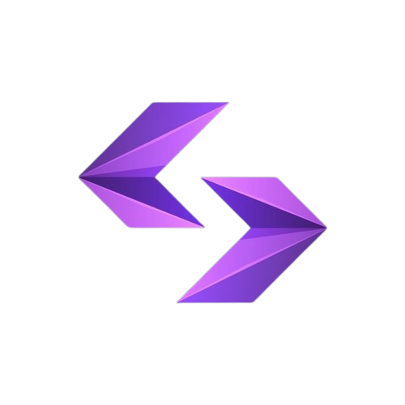

# Algo-Arena

<div align="center">
  
  <br/>
  <br/>
  <p>
    <b>A feature-rich platform for competitive programmers to practice, learn, and compete.</b>
  </p>
</div>

---

## 🚀 About The Project

Algo-Arena is a comprehensive web application built with Next.js and Firebase, designed to provide a seamless experience for coders to hone their problem-solving skills. It features a live code editor, structured learning roadmaps, team collaboration, and real-time leaderboards.

---

## ✨ Features

-   **🔐 Authentication:** Secure user sign-up and login with email/password and Google OAuth.
-   **👤 User Profiles:** Customizable user profiles with stats, streaks, and submission history.
-   **💻 Live Code Editor:** An in-browser Monaco-based code editor with support for multiple languages, custom inputs, and instant feedback.
-   **📚 Learning Roadmap:** Structured learning paths covering various data structures and algorithms.
-   **🧩 Problem Solving:** A curated list of problems with detailed descriptions, test cases, and difficulty levels.
-   **👥 Team Management:** Create and join teams, track group progress, and compete on team-specific leaderboards.
-   **🏆 Leaderboards:** Global and team-based leaderboards to foster a competitive spirit.
-   **📊 Dashboard:** A personalized dashboard to track progress and resume previous sessions.

---

## 🛠️ Built With

-   **[Next.js](https://nextjs.org/)** - React Framework
-   **[TypeScript](https://www.typescriptlang.org/)** - JavaScript with Syntax for Types
-   **[Firebase](https://firebase.google.com/)** - Backend Platform (Authentication, Firestore, Storage)
-   **[Monaco Editor](https://microsoft.github.io/monaco-editor/)** - Code Editor
-   **[CSS Modules](https://github.com/css-modules/css-modules)** - For component-level styling

---

## 🏁 Getting Started

Follow these instructions to get a copy of the project up and running on your local machine for development and testing purposes.

### Prerequisites

-   Node.js (v20 or later)
-   npm, yarn, or pnpm

### Installation

1.  **Clone the repository:**
    ```sh
    git clone https://github.com/your-username/algo-arena.git
    cd algo-arena
    ```

2.  **Install dependencies:**
    ```sh
    npm install
    ```

3.  **Set up environment variables:**
    -   Create a `.env.local` file in the root of the project.
    -   Copy the contents of `.env.example` into your new `.env.local` file.
    -   Fill in the required Firebase credentials. You can get these from your [Firebase project console](https://console.firebase.google.com/).

    ```plaintext
    # .env.local
    NEXT_PUBLIC_FIREBASE_API_KEY="your_api_key"
    NEXT_PUBLIC_FIREBASE_AUTH_DOMAIN="your_auth_domain"
    # ...and so on for all the keys
    ```

### Running the Application

1.  **Start the development server:**
    ```bash
    npm run dev
    ```

2.  Open [http://localhost:3000](http://localhost:3000) with your browser to see the result.

---

## 🤝 Contributing

Contributions are what make the open-source community such an amazing place to learn, inspire, and create. Any contributions you make are **greatly appreciated**.

If you have a suggestion that would make this better, please fork the repo and create a pull request. You can also simply open an issue with the tag "enhancement".

1.  Fork the Project
2.  Create your Feature Branch (`git checkout -b feature/AmazingFeature`)
3.  Commit your Changes (`git commit -m 'Add some AmazingFeature'`)
4.  Push to the Branch (`git push origin feature/AmazingFeature`)
5.  Open a Pull Request

---

## 📄 License

Distributed under the MIT License. See `LICENSE` for more information.

---

## 🙏 Acknowledgments

-   [Next.js Documentation](https://nextjs.org/docs)
-   [Firebase Documentation](https://firebase.google.com/docs)
-   [Monaco Editor Documentation](https://microsoft.github.io/monaco-editor/docs.html)
-   [README Template by othneildrew](https://github.com/othneildrew/Best-README-Template)